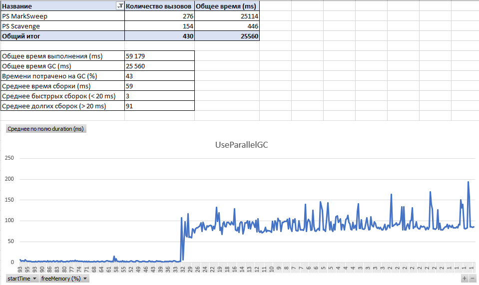

## Сравнение разных сборщиков мусора

Для приложения "App" были произведены замеры для определения оптимального сборщика мусора.    

**В замерах участвовали сборщики:** "UseG1GC" и "UseParallelGC".  
**Версия Java:**  Java version "14.0.1" 2020-04-14  
**Параметры запуска:** -Xms512m -Xmx512m

**Результаты замеров: UseG1GC**  

    

**Результаты замеров: UseParallelGC**  

### Итог
По собранным результатам была сформирована сводная таблица [java-gc-benchmark.xlsx](benchmark-data/java-gc-benchmark.xlsx).  
На основании этих данных видно что и **UseG1GC** и **UseParallelGC** занимают почти 40% от общего времени выполнения программы,   
у обоих сборщиков при активной сборке среднее время "stop the world" 100-150 ms,  
но **UseParallelGC** вызывается в 2 раза реже чем **UseG1GC** поэтому начинает активно работать когда в хипе остаётся меньше 30% памяти,  
в случаи **UseG1GC** активная работа сборщика начинается когда в хипе остается меньше 5% памяти. 
 
С учетом вышенаписанного для текущей платформы и для текучего приложения лучше выбрать **UseG1GC**
т.к. общее время сборки и средняя длительность выполнения одной - одинаковые но активная/интенсивная сборка в **UseG1GC** начинается, когда в хипе почти не осталось место.

