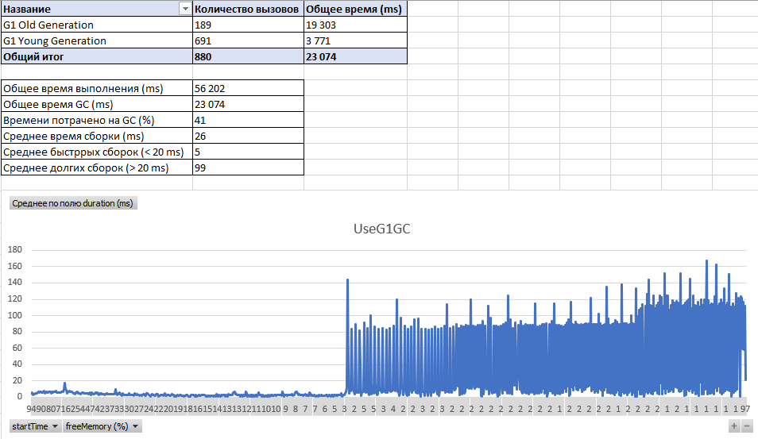

## Сравнение разных сборщиков мусора

Для приложения "App" были произведены замеры для определения оптимального сборщика мусора.    

**В замерах участвовали сборщики:** "UseG1GC" и "UseParallelGC".  
**Версия Java:**  Java version "14.0.1" 2020-04-14  
**Параметры запуска:** -Xms512m -Xmx512m

**Результаты замеров: UseG1GC**  

    

**Результаты замеров: UseParallelGC**  

### Заключение
На основании собранных данных можно сказать, что и **UseG1GC**, и **UseParallelGC** занимают почти 40% от общего времени
выполнения программы. Процесс сборки разделяется на две фазы, **фаза активных сборок**, когда потребления ЦПУ и скорость
сборки высокая и **фаза быстрых сорок**, когда потребления ЦПУ и скорость сборки маленькие.  

По данным из таблиц видно, что в общем случаи **UseParallelGC** вызывается в 2 раза реже чем **UseG1GC** и поэтому начинает 
активно собирать мусор когда в хипе остается менее 30% свободной памяти со среднем временем "stop the world" 59 ms 
что в 2 раза дольше в сравнении с **UseG1GC**, в случаи **UseG1GC** активная сборка мусора начинается когда в хипе остается 
менее 5% свободной памяти со средним временем 26 ms.

**На фазе быстрых сборок** среднее время сборки **UseG1GC** 5 ms а у **UseParallelGC** 3 ms соответственно, что означает то,
что для обоих сборщиков на этой фазе отзывчивость приложения одинаковая (скорость работы приложения) т.к. отклонения
очень невелики.  

**На фазе активных сборок** среднее время сборки **UseG1GC** 99 ms а у **UseParallelGC** 91 ms соответственно, то есть,
можно сказать, что на этой фазе тоже отзывчивость приложения тоже будет одинаковой.

**Если подытожить** все вышесказанное, то можно сказать, что скорость работы приложения на обеих фазах сборки,
быстрых и активных будет одинаковой, то есть приложения будет отзывчивым, быстро работать на фазе быстрых сорок
и начнет тормозить на фазах активных сборок т.к. пауза для "stop the world" будет высокой, но фаза активных сборок
в случаи **UseG1GC** начинается когда уже почти нет место в хипе (< 5%) и поэтому можно сказать что скорость работы
приложения почти не пострадает, в случаи **UseParallelGC** активная сборка начинается когда в хипе остается < 30% что 
отрицательно влияет на скорость работы приложения несмотря на то, что есть достаточно памяти для работы.  

**Поэтому целесообразно** для текущего приложения на текущей платформе как основной сборщик мусора выбрать **UseG1GC**.

